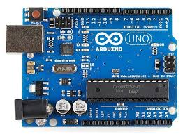
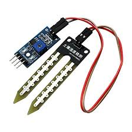
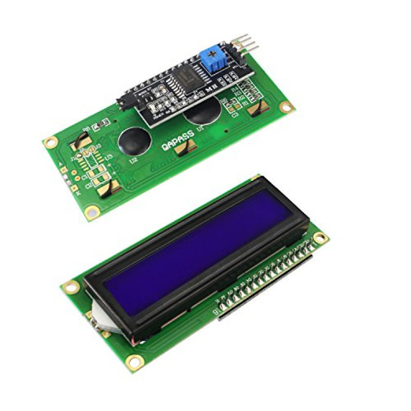
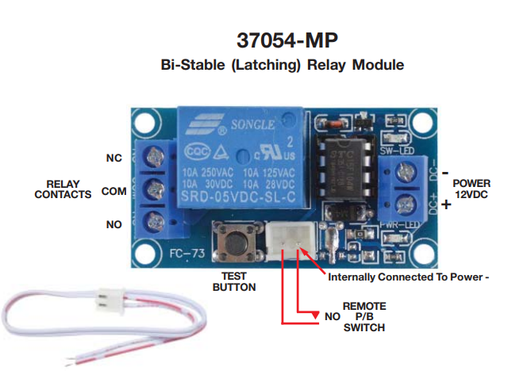
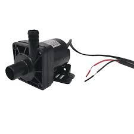
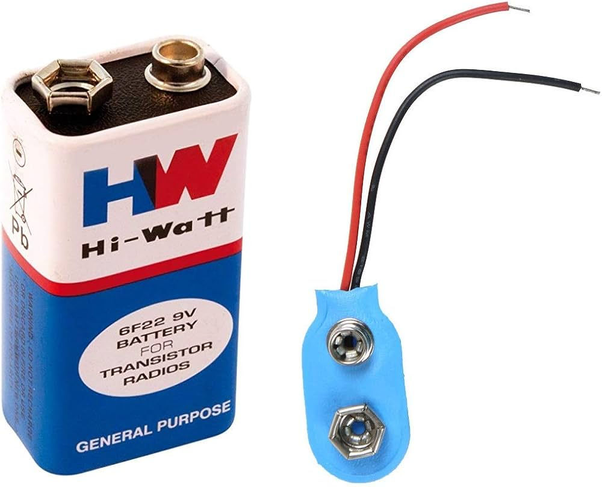
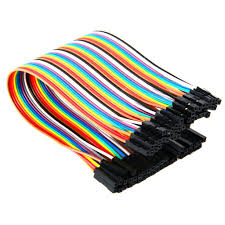

# Components  Required

## 1)ARDUINO UNO 

Arduino is an open-source electronics platforms based on easy-to-use hardware and software. Arduino boards are able to read inputs — light on a sensor, a finger on a button, or a Twitter message — and turn it into an output such as activating a motor, turning on an LED, or publishing something online. 

You can tell your board what to do by sending a set of instructions to the microcontroller on the board. To do so, you use the Arduino programming language (based on Wiring) and the Arduino Software (IDE), based on Processing.

Over the years, Arduino has been the brain of thousands of projects, from everyday objects to complex scientific instruments. A worldwide community of makers — students, hobbyists, artists, programmers, and professionals — has contributed to this open-source platform, creating a huge amount of accessible knowledge for both beginners and experts.

## 2) SOIL MOISTURE SENSOR

The soil moisture sensor (SMS) is a sensor connected to an irrigation system controller that measures soil moisture content in the active root zone before each scheduled irrigation event and bypasses the cycle if soil moisture is above a user- defined set point. 

 The Soil Moisture Sensor uses capacitance to measure dielectric permittivity of the surrounding medium. In soil, dielectric permittivity is a function of water content. The sensor creates a voltage proportional to the dielectric permittivity, and therefore the water content of the soil. 

Soil moisture sensors using reflectometry determine the water content by measuring the change in a specific parameter once it is reflected by the soil. In a reflectometer, there are generally two or three metallic rods that are deeply inserted into the soil. A wave of known parameters is passed through these rods. 

## 3) LCD WITH  I2C MODULE

A liquid-crystal display (LCD) is a flat-panel display or other electronically modulated optical device that uses the light-modulating properties of liquid crystals combined with polarizers. Liquid crystals do not emit light directly but instead use a backlight or reflector to produce images in color or monochrome. 

LCDs are available to display arbitrary images (as in a general-purpose computer display) or fixed images with low information content, which can be displayed or hidden: preset words, digits, and seven-segment displays (as in a digital clock) are all examples of devices with these displays. 

The I2C LCD component is used in applications that require a visual or textual display. This component is also used where a character display is needed but seven consecutive GPIOs on a single GPIO port are not possible. In cases where the project already includes an I2C master, no additional GPIO pins are required. 

## 4) RELAY  MODULE

A power relay module is an electrical switch that is operated by an electromagnet. The electromagnet is activated by a separate low-power signal from a micro controller. When activated, the electromagnet pulls to either open or close an electrical circuit. 

The Relay Interface Module provides one volt- free relay changeover contact on a latching relay. The relay is controlled by a command sent from the fire controller via the addressable loop. The relay state (activated, deactivated or stuck) is returned to the controller.  

It works on the principle of electromagnetism. The electromagnetic field that creates the temporary magnetic field is energised when the relay's circuit detects the fault current. This magnetic field moves the relay armature to open or close connections.  

## 5) DC PUMP

DC powered pumps use direct current from motor, battery, or solar power to move fluid in a variety of ways. Motorized pumps typically operate on 6, 12, 24, or 32 volts of DC power. Solar-powered DC pumps use photovoltaic (PV) panels with solar cells that produce direct current when exposed to sunlight. 

DC water pump is a machine that transports liquid or pressurizes liquid. When the water pump is working, the coil and commutator rotate, but the magnetic steel and carbon brushes do not rotate. The alternating current direction of the coil is changed by the commutator and brushes that rotate with the motor. 

## 6) BATTERY

A nine-volt battery, either disposable or rechargeable, is usually used in smoke alarms, smoke detectors, walkie-talkies, transistor radios, test and instrumentation devices, medical batteries, LCD displays, and other small portable appliances 

A battery is a device that converts chemical energy contained within its active materials directly into electric energy by means of an electrochemical oxidation-reduction (redox) reaction. This type of reaction involves the transfer of electrons from one material to another via an electric circuit. 

## 7) JUMPER WIRES

A jumper wire is an electric wire that connects remote electric circuits used for printed circuit boards. By attaching a jumper wire on the circuit, it can be short-circuited and short-cut (jump) to the electric circuit. 

 A jumper is a small device that can be connected or disconnected to change the settings or configuration of a particular component. It is often used to configure settings on motherboards, hard drives, or optical drives 

 
